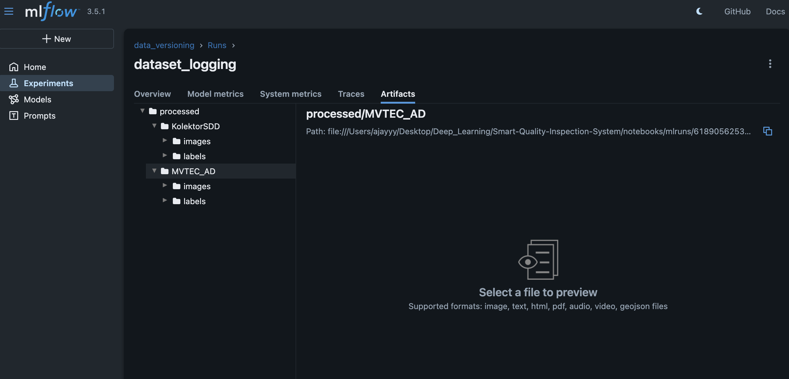

# 🧠 Smart Quality Inspection System (Computer Vision + MLOps)

### 🚩 Problem
Automate visual quality control by detecting surface defects (scratches, dents, etc.) on manufactured parts in real time.

**Why it matters:**  
Factories lose millions because human inspectors get tired, inconsistent, and — let’s be honest — bored.  
This project builds an end-to-end **AI-driven inspection system** that’s fast, scalable, and production-ready.

---

## ⚙️ Tech Stack

- **Model:** YOLOv8 / EfficientDet for detection, SAM for segmentation  
- **Backend:** FastAPI + PostgreSQL  
- **Dashboard:** Streamlit or React  
- **Pipeline:** AWS S3 for image storage, MLflow for model tracking, Docker for deployment  

---

## 🧩 System Architecture
```
Cameras / Edge Devices (RTSP/USB)
         ↓ (edge preproc: resize, denoise, local caching)
Edge / Gateway (optional): lightweight inference for filtering
         ↓ (MQTT / HTTP)
Ingestion API (FastAPI)  ←→  Object Store (AWS S3)
         ↓                       ↑
Preprocessing Service (Docker)    |
         ↓                       |
Training Pipeline (Kubernetes / Batch GPU jobs)  → Model Registry (MLflow)
         ↓
Model Artifact (torchscript/onnx) → CI/CD → Deployment (Dockerized FastAPI / NVIDIA Triton or TorchServe)
         ↓
Real-time Inference (Autoscaled containers) → Post-processing (SAM segmentation)
         ↓
Events DB (Postgres) + Analytics (Prometheus + Grafana)
         ↓
Dashboard (React or Streamlit) + Alerting (Slack/Email)
```
---

## File Structure
```
smart-quality-inspection-system/
│
├── data/
│   ├── raw/                 # Original images
│   ├── processed/           # Cleaned, augmented images
│   └── annotations/         # Labels, bounding boxes, segmentation masks
│
├── notebooks/
│   ├── data_exploration.ipynb
│   ├── model_training.ipynb
│   └── inference_demo.ipynb
│
├── src/
│   ├── data_preprocessing.py
│   ├── train.py
│   ├── inference.py
│   ├── utils/
│   │   ├── augmentations.py
│   │   └── metrics.py
│
├── backend/
│   ├── app.py               # FastAPI app
│   ├── routes/
│   ├── models/
│   └── database/
│       └── schema.sql
│
├── dashboard/
│   ├── app.py     # or React frontend
│
├── deployment/
│   ├── Dockerfile
│   ├── docker-compose.yml
│   ├── mlflow_tracking/
│   └── aws_s3_setup/
│
├── tests/
│   ├── test_model.py
│   ├── test_api.py
│
├── .gitignore
├── requirements.txt
├── README.md
└── LICENSE
```
---


---

## 🧠 Datasets

1. **[MVTec Anomaly Detection](https://www.mvtec.com/company/research/datasets/mvtec-ad)** — industrial parts with pixel-accurate defects.  
2. **[Kolektor Surface-Defect Dataset (KSDD2)](https://www.vicos.si/resources/kolektorsdd2/)** — practical defect detection and segmentation dataset.  
3. **[DAGM 2007](https://www.kaggle.com/datasets)** — classic industrial textures with labeled defects.  
4. **[NEU Surface Defect Database](https://www.kaggle.com/datasets)** — steel surface defect images for classification/detection.

---

## 🏗️ Production Pipeline

### 1. Data Pipeline (Weeks 1–2)
- Collect + augment datasets using Albumentations  
- Clean data (lighting correction, denoise, etc.)  
- Store raw & processed images in AWS S3  
- Version datasets using MLflow
---


---

### 2. Model Development (Weeks 3–4)
- Train YOLOv8 for defect detection  
- Refine segmentation using SAM  
- Log experiments and metrics in MLflow  
- Export final model to ONNX/TorchScript

### 3. Serving & Deployment (Week 5)
- Build inference API with FastAPI  
- Integrate PostgreSQL for metadata logging  
- Containerize model + service using Docker  
- Deploy to AWS ECS or Kubernetes

### 4. Dashboard & Monitoring (Week 6)
- Create Streamlit/React dashboard for live analytics  
- Add Prometheus + Grafana for performance metrics  
- Configure alerting (Slack/email) for high defect rates  
- Enable weekly drift monitoring and model retraining

---

## 🧮 Key Metrics

- **mAP@0.5** ≥ baseline  
- **Latency (P95):** < 200ms on GPU inference  
- **Recall:** maximize at acceptable false-positive rate  
- **Ops Metrics:** Drift detection < 2 false alerts/week  

---

## 🧰 Tools Used

| Component | Tool/Framework |
|------------|----------------|
| Model Training | PyTorch, Ultralytics YOLOv8 |
| Segmentation | SAM (Segment Anything Model) |
| Data Augmentation | Albumentations |
| Model Tracking | MLflow |
| API | FastAPI |
| Dashboard | Streamlit / React |
| Database | PostgreSQL |
| Deployment | Docker, AWS ECS, S3 |
| Monitoring | Prometheus, Grafana |

---

## 🧭 Timeline

| Week | Deliverables |
|------|---------------|
| 1 | Dataset collection, preprocessing, and versioning |
| 2 | Augmentation pipeline and dataset split |
| 3 | YOLOv8 baseline model + MLflow logs |
| 4 | SAM integration + performance tuning |
| 5 | FastAPI inference service + Docker deployment |
| 6 | Dashboard, monitoring, and model retraining setup |


---

## 📜 License

This project is licensed under the MIT License.

---

## 👨‍💻 Author

**Ajay Kumar Prasad**  
B.Tech CSE, NIT Andhra Pradesh  
[LinkedIn](https://linkedin.com/in/ajay-kumar-prasad) | [GitHub](https://github.com/Ajay-Kumar-Prasad)

---
